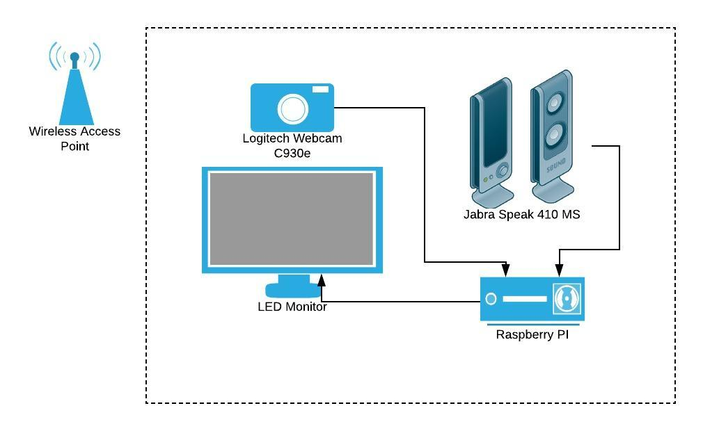
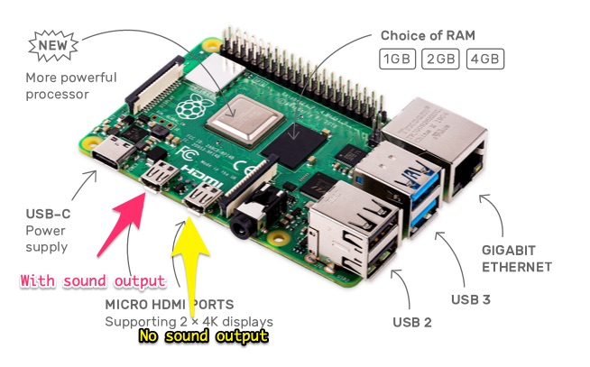

# Raspberry Pi Portal

In order to ease communication between all offices, each location is equipped with one or several always-on communication portals. 

## Hardware

The equipment consists of 4 parts:

- Computer: Raspberry PI with 4GB RAM.
- Webcam: Logitech Webcam C930e.
- Microphone: Jabra Speak 410 MS.
- Screen and Sound output: LED TV e.g. LG LED Smart TV 32LK540BPTA.

### Setup

- Connect the Webcam to the first USB 3.0 input on the Raspberry PI.
- Connect the speaker/microphone to the second USB 3.0 input on the Raspberry PI.
- Connect the first miniHDMI output from the Raspberry PI to an HDMI port on the TV.

### Troubleshooting

- If no sound is sent to the TV, there can be two main solutions:

    - Plug the Mini-HDMI in the first slot.
    
    
    
    - Force HDMI output using [this guide](https://www.raspberrypi.org/documentation/configuration/audio-config.md) (config.txt).
    
- Reduce power consumption and board temperatures by [updating the firmware](https://www.geeks3d.com/20191101/raspberry-pi-4-new-firmware-reduces-power-consumption-and-boards-temperatures/)

## Software

For conference calls, we use the web-based application [Whereby](https://whereby.com/). 

It allows each portal to have a dedicated always-on room:

### Configuration

Log in to Nimble account of Whereby via the Chromium browser.

One logged in to Whereby, edit the settings:

- Set Webcam to use Logitech Webcam C930e.
- Set sound input to Jabra Speak 410 MS.
- Set sound output to the LED TV or to Jabra Speak 410 MS.

### Autostart Whereby

In order to make the Raspberry Pi fully operational without a mouse and keyboard, Whereby -- via the Chromium Browser -- must be configured to start on boot.

We have decided to use `systemd` instead of `autostart` (easier to configure) to have full control on when the application boots. Since Whereby is web-based, the application must wait for thw wifi connection to be working.

1. Create a new Unit file: `sudo nano /lib/systemd/system/whereby.service`. 
2. Paste the content of the file `/systemd/whereby.service` and edit `<USERNAME>` with the actual account handle used.
3. Reload `systemd` to recognize the new service: `sudo systemctl daemon-reload`
4. Start the new service on boot: `sudo systemctl enable whereby.service`.

## License

This project is Copyright (c) Nimble. It is free software,
and may be redistributed under the terms specified in the [LICENSE] file.

[LICENSE]: /LICENSE

## About

This project is maintained and funded by Nimble.

We love open source and do our part in sharing our work with the community!
See [our other projects][community] or [hire our team][hire] to help build your product.

[community]: https://github.com/nimblehq
[hire]: https://nimblehq.co/
